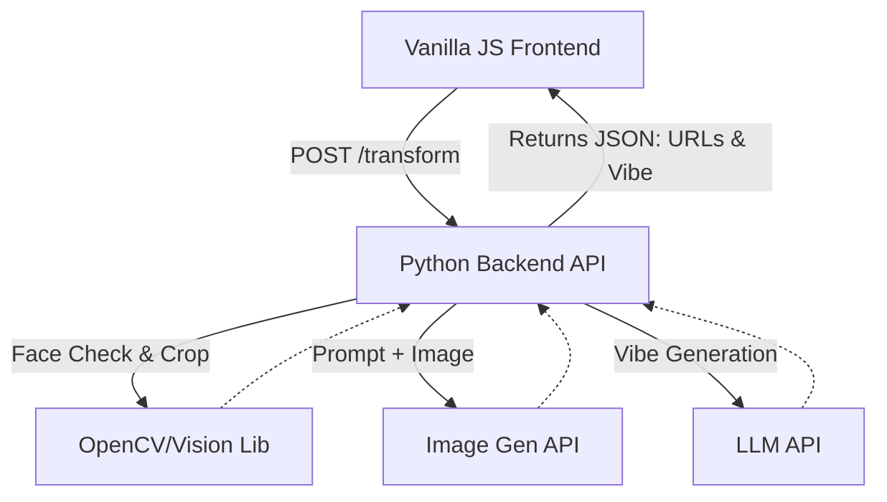

# Engineering Design Document: AI Hairstyle Try-On App

## 1. Architecture Overview
The system follows a minimalist client-server architecture. 



### Components
* **Frontend:** Vanilla HTML/CSS/JS. No heavy frameworks (React/Vue) needed. Focus on fast DOM updates for the image swap.
* **Backend:** Python (FastAPI). Stateless architecture. Processes the image upload, orchestrates calls to external AI APIs for image transformation and the "vibe rating," and returns the result.

## 2. Data Model & API Surface
We do not persist user data. All processing is in-memory and ephemeral.

### API Endpoint: `POST /api/transform`
**Request (Multipart Form Data):**
* `image`: File (The uploaded selfie)
* `preset_id`: String (e.g., "bob", "curtain_bangs", "pixie", "waves")

**Response (JSON):**
```json
{
  "original_image_url": "data:image/jpeg;base64,...",
  "transformed_image_url": "data:image/jpeg;base64,...",
  "vibe_rating": "Serving 90s rom-com protagonist!"
}
```

## 3. Key Trade-offs & Rejected Alternatives
* **Trade-off: Server-side vs. Client-side processing.** 
  * *Decision:* Server-side generation.
  * *Reasoning:* Client-side models are too heavy for a fast, instant experience. We trade server cost for user latency and guaranteed quality.
* **Rejected Alternative: Database storage for history.** 
  * *Reasoning:* Strict scope discipline. We do not need user accounts or lookbooks. Removing the database eliminates state management, schema migrations, and privacy compliance overhead.

## 4. Risks & Mitigations
* **Risk:** High latency from image generation APIs breaking the "magical moment."
* **Mitigation:** Generate the LLM "vibe rating" in parallel with the image generation. Pre-warm connections where possible. Resize/compress the selfie on the frontend *before* uploading to save bandwidth and processing time.

## 5. Testing Strategy

### Unit Tests
* `test_image_compression(image)`: Ensure uploaded images are resized to a maximum of 1024x1024 without losing aspect ratio.
* `test_vibe_prompt_generation(preset_id)`: Verify that the correct LLM prompt is constructed for a given preset.
* `test_validate_upload(file)`: Assert that non-image files or files exceeding the size limit return a clean 400 error.

### Integration Tests
* **The Golden Flow:** `test_full_transformation_flow()` 
  * Mocks the external AI APIs.
  * Posts a dummy image and a valid `preset_id` to `/api/transform`.
  * Asserts the response contains a 200 status, valid base64 image strings, and a non-empty vibe rating.

### Deliberately NOT Tested
* **AI Output Quality:** We will not write tests to evaluate if a hairstyle "looks good." This is subjective and non-deterministic.
* **Frontend UI E2E:** For an MMV, we rely on manual QA for CSS styling and layout. Heavy Cypress/Playwright tests are overkill for this phase.

## 6. Rollout Plan & Scope Boundaries
* **Rollout:** Deploy backend via a simple PaaS (e.g., Render, Railway) or Cloud Run. Frontend hosted on static hosting (Vercel, Netlify, or Github Pages).
* **Strictly Out of Scope:** User authentication, saving images to cloud storage (e.g., S3), background workers (Celery/Redis) since requests must be synchronous for the instant reveal.
